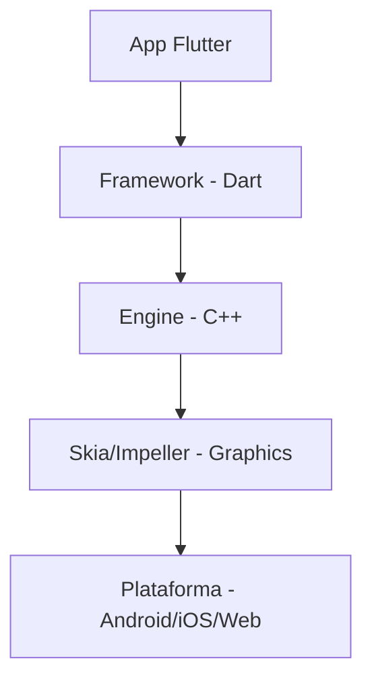

# Aula 01 - Introdução ao Desenvolvimento Multiplataforma 🌍

!!! info "Conceito"
    O desenvolvimento **multiplataforma** permite que você escreva o código uma única vez e o execute em diferentes sistemas operacionais como Android, iOS, Web e Desktop.

---

## 1. O que é desenvolvimento multiplataforma? 🤔

Historicamente, para criar um app para Android e outro para iOS, você precisava de duas equipes e dois códigos diferentes (Java/Kotlin e Objective-C/Swift). Com o Flutter, usamos uma **única base de código**.

### 📱 Diferença entre Nativo e Híbrido

<div class="grid cards" markdown>

-   **Nativo**
    ---
    Código específico para a plataforma. Performance máxima, mas custo dobrado.

-   **Híbrido (WebView)**
    ---
    Roda dentro de um navegador interno. Lento e com interface que parece um site.

-   **Flutter (Canvas)**
    ---
    Desenha cada pixel na tela. Performance próxima ao nativo e interface idêntica em tudo.

</div>

---

## 2. Ecossistema Flutter 🎨

O Flutter é o framework do Google para criar interfaces bonitas e rápidas.

### 📊 Estrutura de Renderização



---

## 3. Instalação e Ambiente 🛠️

Para começar, precisamos preparar o terreno:

```termynal
$ flutter doctor
Doctor summary (to see all details, run flutter doctor -v):
[√] Flutter (Channel stable, 3.19.0)
[√] Windows Version (Version 10.0.19045.3930)
[√] Android toolchain - develop for Android devices
[√] VS Code (version 1.86.1)
[√] Connected device (1 available)
```

!!! tip "Dica"
    Sempre execute o `flutter doctor` para verificar se há pendências na sua instalação.

---

## 4. Mini-Projeto: Olá Flutter! 🚀

Vamos criar seu primeiro projeto pelo terminal:

1.  Abra o terminal.
2.  Digite os comandos abaixo:

```bash
flutter create meu_primeiro_app
cd meu_primeiro_app
flutter run
```

---

## 5. Exercício de Fixação 🧠

1.  Explique com suas palavras a maior vantagem do Flutter em relação ao desenvolvimento nativo tradicional.
2.  Qual a função do comando `flutter doctor`?
3.  O que significa dizer que o Flutter "desenha seus próprios widgets"?

---

**Próxima Aula**: Vamos aprender a [Linguagem Dart para Iniciantes](./aula-02.md)! 🎯
