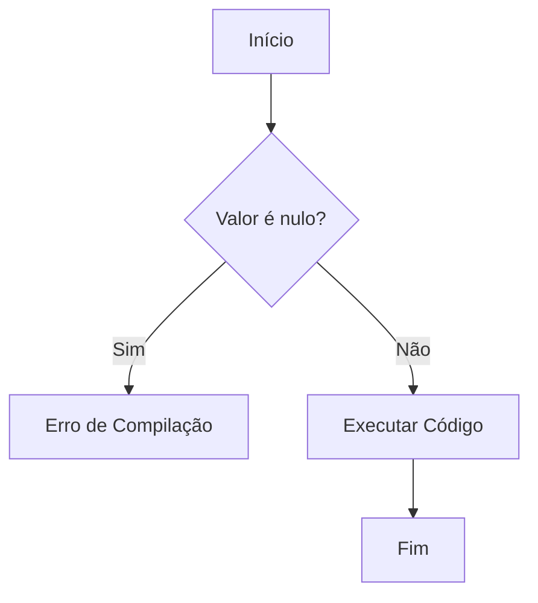

# Aula 02 - Linguagem Dart para Iniciantes 🎯

!!! info "O que é Dart?"
    Dart é a linguagem por trás do Flutter. Criada pelo Google, ela é otimizada para interfaces rápidas, possui tipagem forte e é muito produtiva.

---

## 1. Variáveis e Tipos de Dados 📦

No Dart, tudo é um objeto. Os tipos mais comuns são:

```dart
String nome = "Flutter";
int idade = 5;
double versao = 3.19;
bool isGratis = true;

// Inferência de tipo
var cidade = "São Paulo"; 
```

---

## 2. Estruturas de Controle 🚦

### Condicionais (if/else)
```dart
int nota = 8;
if (nota >= 7) {
  print("Aprovado!");
} else {
  print("Recuperação");
}
```

### Repetição (for)
```dart
for (int i = 0; i < 5; i++) {
  print("Contagem: $i");
}
```

---

## 3. Funções e Null Safety 🧠

O Dart possui **Null Safety**, o que significa que variáveis não podem ser nulas por padrão, evitando erros comuns.

```dart
// ? permite que a variável seja nula
String? nomeNulavel; 

void saudar(String nome) {
  print("Olá, $nome!");
}
```

---

## 4. Diagrama de Fluxo (Mermaid) 📊



---

## 5. Mini-Projeto: Calculadora de IMC Simples 🚀

Crie um arquivo `imc.dart` e execute-o com `dart run`:

```dart
void main() {
  double peso = 80.0;
  double altura = 1.80;
  double imc = peso / (altura * altura);
  
  print("Seu IMC é: ${imc.toStringAsFixed(2)}");
}
```

```termynal
$ dart run imc.dart
Seu IMC é: 24.69
```

---

## 6. Exercício de Fixação 🧠

1.  Crie uma variável para armazenar o nome de um aplicativo e outra para a versão (ex: 1.0).
2.  Escreva uma estrutura que verifique se a versão é maior ou igual a 2.0 e imprima "Versão atualizada".
3.  O que acontece se você tentar atribuir `null` a uma variável `int x = 10;` sem o operador `?`?

---

**Próxima Aula**: Vamos entender a [Estrutura de um Projeto Flutter](./aula-03.md)! 🏗️
