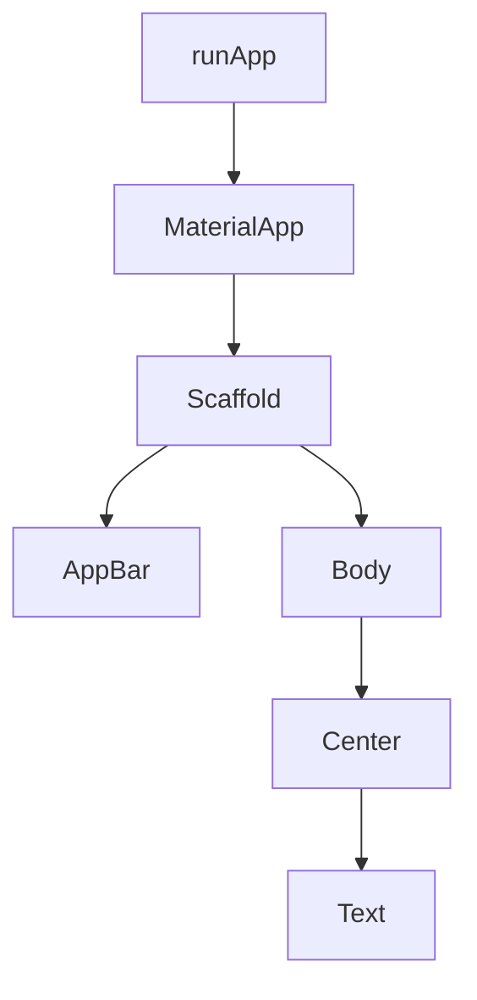

# Aula 03 - Estrutura de um Projeto Flutter 🏗️

!!! tip "Dica"
    Compreender onde cada arquivo fica é fundamental para não se perder conforme o projeto cresce.

---

## 1. Arquivos e Pastas Principais 📂

Ao criar um projeto, o Flutter gera uma estrutura padrão:

*   **`lib/`**: Onde mora o código Dart. 99% do seu trabalho será aqui.
*   **`android/`, `ios/`, `web/`**: Pastas que contêm o código específico de cada plataforma para o build.
*   **`pubspec.yaml`**: O "RG" do projeto. Aqui definimos o nome, versão, dependências e assets (imagens/fontes).
*   **`test/`**: Onde escrevemos os testes automatizados.

---

## 2. O arquivo pubspec.yaml 📝

Este é o arquivo de configuração mais importante do seu projeto.

```yaml
name: meu_projeto
description: Um novo app Flutter.
version: 1.0.0+1

dependencies:
  flutter:
    sdk: flutter
  http: ^1.1.0 # Exemplo de dependência externa
```

```termynal
$ flutter pub get
Resolving dependencies...
Got dependencies!
```

---

## 3. O arquivo main.dart 🚀

O ponto de entrada de qualquer aplicativo é a função `main()`.

```dart
import 'package:flutter/material.dart';

void main() {
  runApp(const MyApp());
}
```

### Árvore de Widgets (Mermaid) 📊



---

## 4. Mini-Projeto: Adicionando Dependências 🚀

1.  Abra o `pubspec.yaml`.
2.  Adicione a dependência `google_fonts: ^6.1.0`.
3.  Rode `flutter pub get` no terminal.

---

## 5. Exercício de Fixação 🧠

1.  Para que serve a pasta `lib`?
2.  Qual comando usamos para baixar novas dependências listadas no `pubspec.yaml`?
3.  Qual a função principal que inicia o aplicativo no Flutter?

---

**Próxima Aula**: Vamos mergulhar nos [Widgets: A Base de Tudo](./aula-04.md)! 🧱
