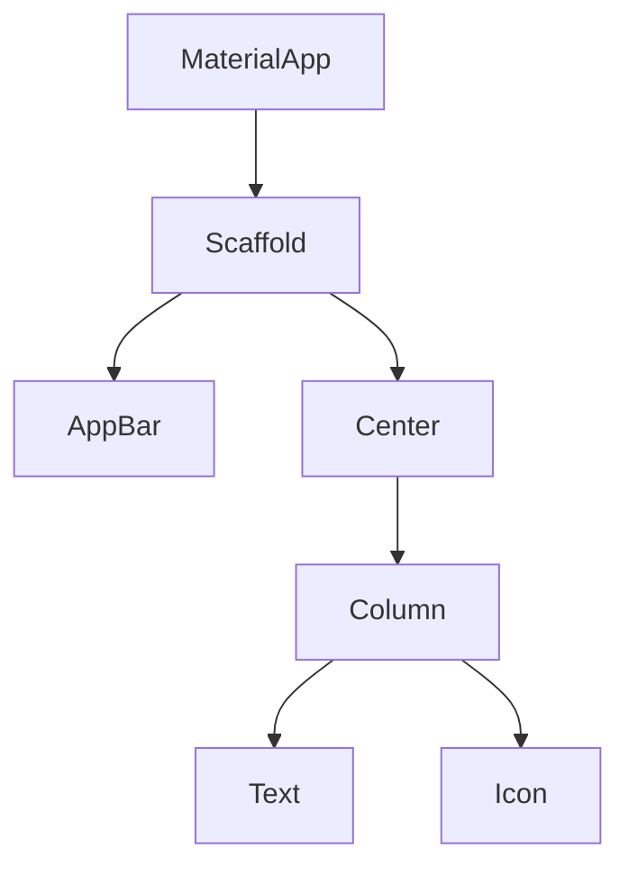

# Aula 04 - Widgets: A Base de Tudo 🧱

!!! info "Conceito"
    No Flutter, **tudo é um Widget**. Um botão é um widget, uma cor é um widget, o próprio aplicativo é um widget.

---

## 1. O que são Widgets? 🤔

Widgets são as peças de Lego da interface. Existem dois tipos principais que você usará o tempo todo:

### ⚪ StatelessWidget (Estático)
Não muda de estado. Exemplo: Um texto fixo ou um ícone.

### 🔴 StatefulWidget (Dinâmico)
Pode mudar conforme a interação do usuário. Exemplo: Um contador ou uma caixa de checkout.

---

## 2. Árvore de Widgets 🌳

A interface do Flutter é organizada de forma hierárquica.



---

## 3. Hot Reload: O Super Poder do Flutter ⚡

Diferente do desenvolvimento tradicional onde você precisa recompilar tudo para ver uma mudança, o Flutter tem o **Hot Reload**. Você salva o arquivo e a mudança aparece instantaneamente no emulador.

```termynal
$ flutter run
...
Performing hot reload...
Reloaded 1 of 534 libraries in 126ms.
```

---

## 4. Estrutura Material Design 🎨

O Flutter já vem com o sistema de design do Google (Material) pronto para usar.

```dart
Scaffold(
  appBar: AppBar(title: Text("Meu App")),
  body: Center(child: Text("Olá mundo")),
  floatingActionButton: FloatingActionButton(
    onPressed: () {},
    child: Icon(Icons.add),
  ),
)
```

---

## 5. Mini-Projeto: Contador Colorido 🚀

1.  Crie um novo projeto.
2.  Altere a cor do `FloatingActionButton` no `main.dart`.
3.  Use o `Hot Reload` para ver a cor mudar instantaneamente.

---

## 6. Exercício de Fixação 🧠

1.  Diferencie `StatelessWidget` de `StatefulWidget`.
2.  O que é a Árvore de Widgets?
3.  Como o `Hot Reload` acelera o desenvolvimento?

---

**Próxima Aula**: Vamos aprender sobre [Layouts e Organização Visual](./aula-05.md)! 🎨