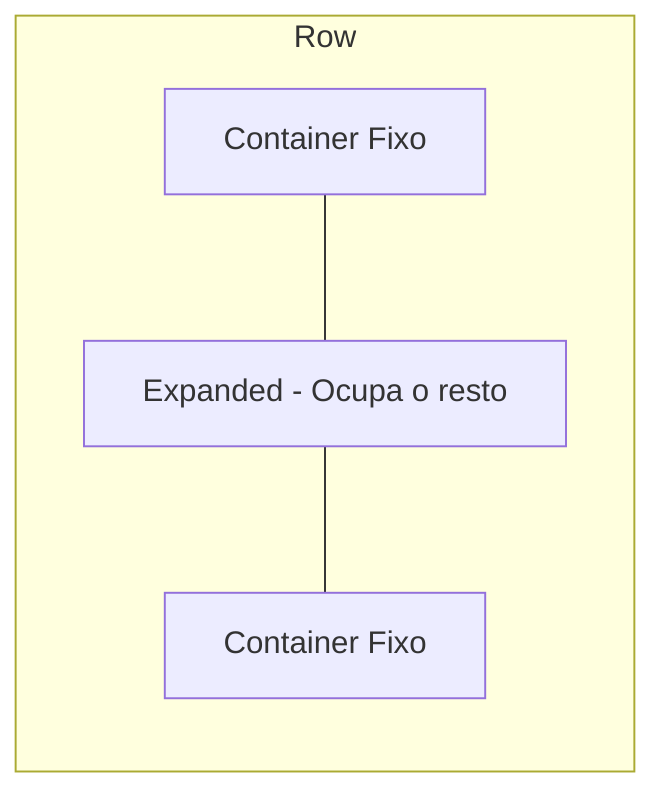

# Aula 05 - Layouts e Organização Visual 🎨

!!! tip "Dica"
    Um bom layout é o que separa um app amador de um profissional. O segredo está em saber alinhar os elementos.

---

## 1. Column e Row: A Base de Tudo 🏗️

A maioria das interfaces é composta por elementos empilhados verticalmente ou lado a lado.

*   **Column**: Alinha widgets de cima para baixo.
*   **Row**: Alinha widgets da esquerda para a direita.

### Propriedades de Alinhamento
*   `mainAxisAlignment`: Alinha no eixo principal (vertical para Column, horizontal para Row).
*   `crossAxisAlignment`: Alinha no eixo cruzado.

---

## 2. Container, Padding e Margin 📦

*   **Container**: Funciona como uma caixa onde você pode definir cor de fundo, bordas e tamanho.
*   **Padding**: Espaço **interno**.
*   **Margin**: Espaço **externo**.

```dart
Container(
  padding: EdgeInsets.all(16),
  margin: EdgeInsets.symmetric(horizontal: 10),
  color: Colors.blue,
  child: Text("Conteúdo"),
)
```

---

## 3. Expanded e Flexible ↔️

Servem para controlar como os widgets ocupam o espaço disponível.



---

## 4. Praticando Layouts (Termynal) 💻

```termynal
$ flutter create layout_app
$ cd layout_app
# Substitua o body por uma Column com 3 Containers coloridos
$ flutter run
```

---

## 5. Mini-Projeto: Perfil de Usuário Simples 🚀

Crie uma interface que contenha:
1.  Uma `Column` principal.
2.  Uma `CircleAvatar` para a foto.
3.  Um `Text` para o nome.
4.  Uma `Row` com ícones de redes sociais.

---

## 6. Exercício de Fixação 🧠

1.  Qual a diferença entre `MainAxisAlignment` e `CrossAxisAlignment` em uma `Column`?
2.  Para que serve o widget `Expanded`?
3.  Como adicionamos espaço interno a um `Container`?

---

**Próxima Aula**: Vamos explorar os [Componentes Visuais](./aula-06.md)! 🖼️
