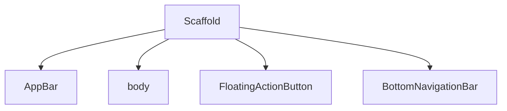

# Aula 06 - Componentes Visuais 🖼️

!!! info "Material Design"
    O Flutter facilita o uso de componentes que seguem o padrão Material Design, garantindo consistência visual.

---

## 1. Text, Icon e Image 📸

Esses são os blocos básicos para exibir informação.

```dart
Text("Estilizado", style: TextStyle(fontSize: 20, fontWeight: FontWeight.bold)),
Icon(Icons.favorite, color: Colors.red),
Image.network("https://url-da-imagem.com"),
```

---

## 2. Buttons: Interação com o Usuário 🖱️

Existem diversos tipos de botões pré-estilizados:

*   **ElevatedButton**: Botão com sombra e relevo.
*   **TextButton**: Botão apenas com texto (para ações secundárias).
*   **OutlinedButton**: Botão com borda contínua.

```dart
ElevatedButton(
  onPressed: () { print("Clicou!"); },
  child: Text("Salvar"),
)
```

---

## 3. AppBar e Scaffold 🏗️

O **Scaffold** é o esqueleto da tela, e a **AppBar** é a barra de título superior.



---

## 4. Testando Componentes (Termynal) 💻

```termynal
$ # Experimente trocar o Icon por um Image.asset no seu projeto
$ flutter pub get
$ flutter run
```

---

## 5. Mini-Projeto: Tela de Boas-Vindas 🚀

Crie uma tela que tenha:
1.  Uma imagem centralizada.
2.  Um texto de boas-vindas grande.
3.  Um botão "Começar" no final da página.

---

## 6. Exercício de Fixação 🧠

1.  Como alteramos o tamanho da fonte em um widget `Text`?
2.  Cite três tipos de botões do Flutter.
3.  Para que serve o widget `Scaffold`?

---

**Próxima Aula**: Vamos aprender a [Navegação entre Telas](./aula-07.md)! 🛣️
