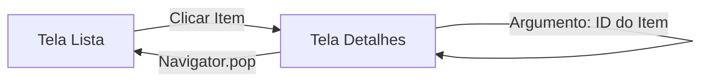

# Aula 07 - Navegação entre Telas 🛣️

!!! info "Conceito"
    Raramente um aplicativo tem apenas uma tela. A navegação permite que o usuário transite entre diferentes funcionalidades de forma fluida.

---

## 1. Navigator e Pilha de Telas 📚

O Flutter usa o conceito de **Pilha (Stack)** para navegação. Imagine uma pilha de pratos:
*   **Push**: Adiciona uma nova tela no topo.
*   **Pop**: Remove a tela atual e volta para a anterior.

```dart
// Indo para uma nova tela
Navigator.push(
  context,
  MaterialPageRoute(builder: (context) => OutraTela()),
);

// Voltando
Navigator.pop(context);
```

---

## 2. Rotas Nomeadas 🏷️

Para aplicativos maiores, é melhor organizar as rotas por nomes no `MaterialApp`.

```dart
MaterialApp(
  initialRoute: '/',
  routes: {
    '/': (context) => TelaHome(),
    '/detalhes': (context) => TelaDetalhes(),
  },
);

// Navegando
Navigator.pushNamed(context, '/detalhes');
```

---

## 3. Passagem de Parâmetros 📦

Podemos enviar dados de uma tela para outra através do construtor ou do `ModalRoute`.

### Flow de Navegação (Mermaid) 📊



---

## 4. Testando Rotas (Termynal) 💻

```termynal
$ flutter create rotas_app
# Crie dois widgets de tela no main.dart
$ flutter run
```

---

## 5. Mini-Projeto: App de Receitas 🚀

Crie duas telas:
1.  **Lista de Receitas**: Uma lista com nomes de pratos.
2.  **Detalhe da Receita**: Ao clicar em um prato, navegue para uma tela que mostre o nome da receita selecionada.

---

## 6. Exercício de Fixação 🧠

1.  O que acontece com a tela atual quando usamos `Navigator.push`?
2.  Qual a principal vantagem de usar "Rotas Nomeadas"?
3.  Como voltamos para a tela anterior sem fechar o app?

---

**Próxima Aula**: Vamos aprender a criar [Formulários e Validação](./aula-08.md)! 📝