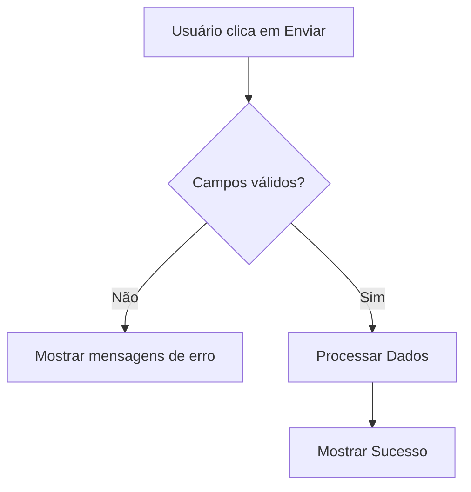

# Aula 08 - Formulários e Validação 📝

!!! info "Interatividade"
    Formulários são a principal forma de capturar dados do usuário, seja para um cadastro, login ou busca.

---

## 1. TextField e Controllers ⌨️

O `TextField` é o widget básico de entrada de texto. Para capturar o que o usuário digita, usamos um `TextEditingController`.

```dart
final controller = TextEditingController();

TextField(
  controller: controller,
  decoration: InputDecoration(labelText: "Seu Nome"),
)

// Acessando o valor
print(controller.text);
```

---

## 2. Form e TextFormField 🧱

Para validações complexas, usamos o widget `Form` em conjunto com o `TextFormField`.

```dart
TextFormField(
  validator: (value) {
    if (value == null || value.isEmpty) {
      return "Campo obrigatório";
    }
    return null;
  },
)
```

---

## 3. Validação de Dados ✅

A validação garante que o usuário insira os dados no formato correto antes de enviarmos para um banco de dados ou API.

### Fluxo de Validação (Mermaid) 📊



---

## 4. Máscaras Básicas 🎭

Podemos usar o pacote `mask_text_input_formatter` para campos de CPF, Telefone ou Data.

```termynal
$ flutter pub add mask_text_input_formatter
```

---

## 5. Mini-Projeto: Tela de Cadastro 🚀

Crie um formulário com:
1.  Campo de E-mail (com validação de `@`).
2.  Campo de Senha (mínimo 6 caracteres).
3.  Botão que só exibe uma `SnackBar` de sucesso se os dados forem válidos.

---

## 6. Exercício de Fixação 🧠

1.  Para que serve o `TextEditingController`?
2.  Qual a diferença entre `TextField` e `TextFormField`?
3.  Como acionamos a validação de um formulário?

---

**Próxima Aula**: Vamos dominar o [Gerenciamento de Estado](./aula-09.md)! 🔄
