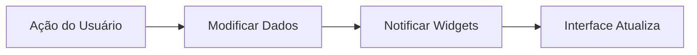

# Aula 09 - Gerenciamento de Estado 🔄

!!! warning "Atenção"
    Gerenciar o estado é um dos tópicos mais importantes. Se o estado estiver bagunçado, o app terá bugs visuais e perda de dados.

---

## 1. O que é Estado? 🤔

Estado é qualquer dado que pode mudar durante a vida do aplicativo e que precisa ser refletido na interface (ex: contador, itens no carrinho, se o usuário está logado).

---

## 2. setState: O Básico 🔴

Para mudanças simples dentro de um único widget, usamos o `setState`. Ele avisa ao Flutter: "Ei, algo mudou, redesenhe a tela!".

```dart
int contador = 0;

void incrementar() {
  setState(() {
    contador++;
  });
}
```

---

## 3. Introdução ao Provider 🔷

Conforme o app cresce, o `setState` fica difícil de gerenciar. O **Provider** é uma das soluções mais populares para gerenciar estado de forma global.

### Ciclo de Vida do Estado (Mermaid) 📊



---

## 4. Instalando o Provider (Termynal) 💻

```termynal
$ flutter pub add provider
```

---

## 5. Mini-Projeto: Lista de Favoritos 🚀

Crie um app onde:
1.  O usuário pode clicar em um botão de "coração" em um item.
2.  O estado do coração (preenchido ou vazio) deve ser persistido enquanto o app estiver aberto.
3.  Use um `ChangeNotifier` para gerenciar essa lista.

---

## 6. Exercício de Fixação 🧠

1.  O que acontece com a interface quando chamamos `setState`?
2.  Por que não usamos `setState` para tudo em apps grandes?
3.  Qual o papel do `notifyListeners()` no Provider?

---

**Próxima Aula**: Vamos aprender o [Consumo de APIs REST](./aula-10.md)! 📡
