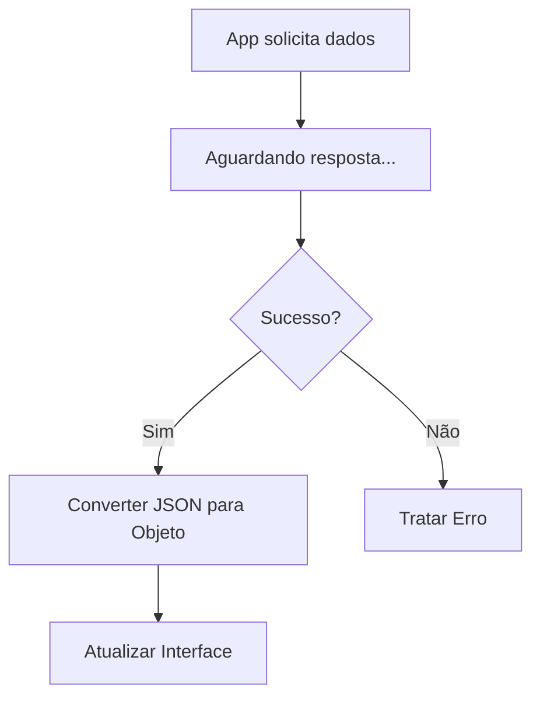

# Aula 10 - Consumo de APIs REST 📡

!!! info "Comunicação"
    A maioria dos aplicativos modernos depende de dados vindos da internet. Saber consumir uma API REST é essencial para qualquer desenvolvedor.

---

## 1. O que é uma API REST? 🌐

REST é um conjunto de regras que permite que o seu app converse com um servidor. Usamos o protocolo HTTP para enviar e receber dados, geralmente no formato **JSON**.

### Principais Métodos
*   **GET**: Buscar dados.
*   **POST**: Enviar dados novos.
*   **PUT/PATCH**: Atualizar dados.
*   **DELETE**: Remover dados.

---

## 2. Pacote HTTP e JSON 📦

Para fazer requisições, usamos o pacote `http`.

```dart
import 'package:http/http.as http;
import 'dart:convert';

Future<void> buscarDados() async {
  final response = await http.get(Uri.parse('https://api.exemplo.com/dados'));
  if (response.statusCode == 200) {
    var dados = jsonDecode(response.body);
    print(dados['projeto']);
  }
}
```

---

## 3. Future e Async/Await ⏳

Como a internet pode ser lenta, não podemos travar o app esperando a resposta. Usamos **Programação Assíncrona**.

### Ciclo de Requisição (Mermaid) 📊



---

## 4. Instalando Dependências (Termynal) 💻

```termynal
$ flutter pub add http
```

---

## 5. Mini-Projeto: App de CEP 🚀

Crie um app que:
1.  Tenha um campo para digitar o CEP.
2.  Consuma a API do `ViaCEP` (`https://viacep.com.br/ws/CEP/json/`).
3.  Exiba o endereço na tela.

---

## 6. Exercício de Fixação 🧠

1.  Para que serve o comando `await`?
2.  O que é o `jsonDecode`?
3.  Por que usamos `Future` em requisições de rede?

---

**Próxima Aula**: Vamos aprender a [Persistência de Dados](./aula-11.md)! 💾
