# Aula 11 - Persistência de Dados 💾

!!! info "Dados Locais"
    Nem tudo precisa de internet. Às vezes queremos salvar preferências do usuário ou dados que funcionem offline.

---

## 1. SharedPreferences 🔑

Ideal para salvar pequenas quantidades de dados, como configurações (Ex: tema escuro, se o usuário já viu o tutorial). Salva pares de **Chave-Valor**.

```dart
final prefs = await SharedPreferences.getInstance();
await prefs.setBool('show_ads', false);
bool? showAds = prefs.getBool('show_ads');
```

---

## 2. Banco de Dados Local (SQLite) 🗄️

Para grandes volumes de dados (como uma lista de tarefas ou contatos), usamos o SQLite através do pacote `sqflite`.

### Estrutura CRUD
*   **C**reate (Inserir)
*   **R**ead (Ler)
*   **U**pdate (Atualizar)
*   **D**elete (Excluir)

---

## 3. Fluxo de Dados Offline (Mermaid) 📊

```mermaid
graph LR
    A[App] --> B{Tem Internet?}
    B -- Sim --> C[Buscar na API]
    B -- Não --> D[Buscar no Banco Local]
    C --> E[Salvar no Banco Local]
    D --> F[Mostrar na Tela]
    E --> F
```



---

## 4. Instalando Pacotes (Termynal) 💻

```termynal
$ flutter pub add sqflite path_provider shared_preferences
```

---

## 5. Mini-Projeto: Bloco de Notas Simples 🚀

Crie um app que:
1.  Permita escrever uma nota.
2.  Salve a nota no `SharedPreferences` ao fechar o app.
3.  Recupere a nota automaticamente ao abrir o app novamente.

---

## 6. Exercício de Fixação 🧠

1.  Quando devemos usar `SharedPreferences` em vez de um Banco de Dados SQL?
2.  O que significa a sigla CRUD?
3.  Qual a principal vantagem de ter um banco de dados local no app?

---

**Próxima Aula**: Vamos aprender a [Organização Profissional do Projeto](./aula-12.md)! 🏛️