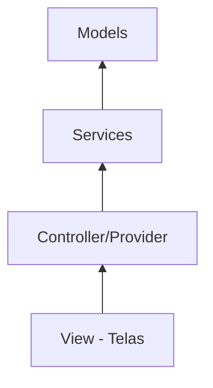

# Aula 12 - Organização Profissional do Projeto 🏛️

!!! tip "Escalabilidade"
    Organizar bem o código é o que permite que um projeto dure anos e seja fácil de manter por vários desenvolvedores.

---

## 1. Separação por Camadas 🍰

Não devemos colocar tudo dentro da interface. Dividimos o código em responsabilidades:

*   **Model**: Representa os dados (Classes Dart).
*   **Service**: Lida com a comunicação externa (APIs, Banco de Dados).
*   **Controller/Provider**: Gerencia a lógica de negócio e o estado.
*   **View**: Apenas desenha a interface na tela.

---

## 2. Clean Architecture (Simplificada) 🏗️

A ideia é que a interface dependa da lógica, e não o contrário.

### Diagrama de Dependências (Mermaid) 📊



---

## 3. Boas Práticas de Código ✨

*   **Nomes Claros**: `getUserData()` é melhor que `getD()`.
*   **Don't Repeat Yourself (DRY)**: Se você está copiando e colando código, crie uma função ou widget reutilizável.
*   **Single Responsibility**: Cada arquivo deve fazer apenas uma coisa bem feita.

---

## 4. Organizando Pastas (Termynal) 📂

```termynal
$ mkdir lib/models lib/services lib/providers lib/views
$ ls lib/
models/
providers/
services/
views/
main.dart
```

---

## 5. Mini-Projeto: Refatorando o App de CEP 🚀

Pegue o projeto da Aula 10 e organize-o:
1.  Crie uma classe `EnderecoModel`.
2.  Crie um `EnderecoService` para a chamada HTTP.
3.  Crie um `EnderecoProvider` para gerenciar o estado da busca.

---

## 6. Exercício de Fixação 🧠

1.  Por que não devemos fazer chamadas de API diretamente dentro do widget da tela?
2.  O que é um "Model" no contexto de camadas de software?
3.  Qual a vantagem de usar Widgets reutilizáveis?

---

**Próxima Aula**: Vamos aprender a [Publicar para Android](./aula-13.md)! 🤖
