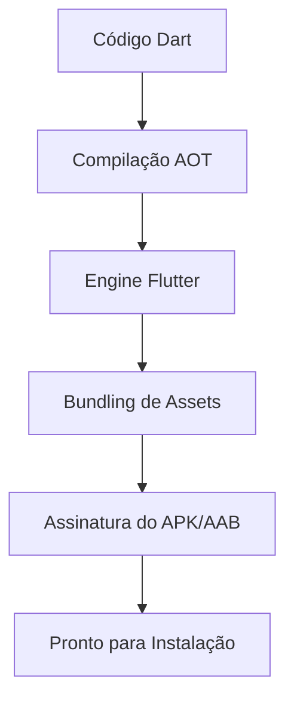

# Aula 13 - Publicando para Android 🤖

!!! info "O Ecossistema Android"
    Publicar para Android exige algumas configurações no Gradle e a geração de uma chave de assinatura (Keystore).

---

## 1. Configurações do SDK e Gradle 🛠️

O arquivo `android/app/build.gradle` controla as versões do Android suportadas pelo seu app.

*   **minSdkVersion**: Versão mínima do Android que pode rodar o app.
*   **targetSdkVersion**: Versão para a qual o app foi otimizado.
*   **versionCode**: Número interno da versão (ex: 1, 2, 3).
*   **versionName**: Versão amigável ao usuário (ex: 1.0.0).

---

## 2. Gerando o APK e o App Bundle 📦

### APK (Android Package)
Usado para instalação direta no dispositivo.
```bash
flutter build apk --release
```

### App Bundle (AAB)
O formato obrigatório para a Google Play Store. O Google otimiza o tamanho do app para cada dispositivo.
```bash
flutter build appbundle
```

---

## 3. Ícone e Nome do Aplicativo 🎨

Para trocar o ícone em todas as resoluções de forma automática, usamos o pacote `flutter_launcher_icons`.

### Fluxo de Build (Mermaid) 📊



---

## 4. Testes em Dispositivo Físico (Termynal) 💻

Testar em um celular de verdade é essencial para validar a performance.

```termynal
$ flutter devices
$ flutter run -d [id-do-dispositivo]
```

---

## 5. Mini-Projeto: Gerando seu primeiro APK 🚀

1.  Troque o nome do app no `AndroidManifest.xml`.
2.  Execute o comando `flutter build apk`.
3.  Localize o arquivo gerado em `build/app/outputs/flutter-apk/app-release.apk`.

---

## 6. Exercício de Fixação 🧠

1.  Qual a diferença entre APK e App Bundle?
2.  Para que serve o `minSdkVersion`?
3.  Por que devemos testar em dispositivos físicos e não apenas em emuladores?

---

**Próxima Aula**: Vamos aprender a [Publicar para Web](./aula-14.md)! 🌐