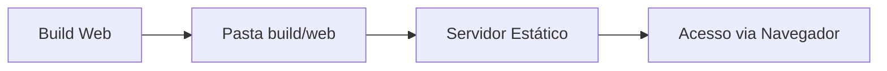

# Aula 14 - Publicando para Web 🌐

!!! info "Flutter Web"
    O Flutter converte seu código Dart em HTML, CSS e JavaScript, permitindo que o app rode em qualquer navegador moderno.

---

## 1. Responsividade: O Desafio da Web 📱💻

Diferente do celular, na web o usuário pode redimensionar a janela a qualquer momento. Precisamos usar o widget `LayoutBuilder` ou pacotes como `responsive_framework`.

```dart
LayoutBuilder(
  builder: (context, constraints) {
    if (constraints.maxWidth > 800) {
      return VistaDesktop();
    } else {
      return VistaMobile();
    }
  },
)
```

---

## 2. Compilação para Web 🏗️

O Flutter oferece dois motores de renderização para a web:
*   **HTML**: Menor tamanho de arquivo, melhor para SEO.
*   **CanvasKit (WebAssembly)**: Melhor performance e fidelidade visual (idêntico ao mobile).

```bash
flutter build web --release
```

---

## 3. Deploy Simples 🚀

Após o build, o Flutter gera uma pasta `build/web/`. Você pode subir esses arquivos para o **GitHub Pages**, **Firebase Hosting** ou **Netlify**.

### Fluxo de Deploy (Mermaid) 📊



---

## 4. Rodando na Web (Termynal) 💻

```termynal
$ flutter devices
$ flutter run -d chrome
$ flutter build web
```

---

## 5. Mini-Projeto: Portfólio Web 🚀

Adapte um dos seus mini-projetos anteriores para:
1.  Ter uma barra de navegação lateral no desktop.
2.  Ter uma barra de navegação inferior no mobile.

---

## 6. Exercício de Fixação 🧠

1.  Como o Flutter lida com diferentes tamanhos de tela na Web?
2.  Qual a pasta que contém o resultado final do build para web?
3.  Cite uma ferramenta de hospedagem gratuita para o Flutter Web.

---

**Próxima Aula**: Vamos explorar [Aplicações Desktop](./aula-15.md)! 💻
