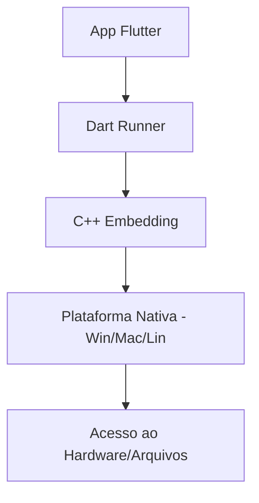

# Aula 15 - Aplicações Desktop 💻

!!! info "Windows, macOS e Linux"
    O Flutter permite criar aplicativos de desktop nativos com acesso total ao sistema de arquivos e periféricos.

---

## 1. Habilitando o suporte Desktop 🛠️

Dependendo do seu sistema operacional, você precisará instalar ferramentas extras (como o Visual Studio com C++ para Windows).

```bash
flutter config --enable-windows-desktop
flutter config --enable-macos-desktop
flutter config --enable-linux-desktop
```

---

## 2. Ajustes de Layout para Desktop 🖥️

No desktop, temos janelas que podem ser maximizadas. Usamos o mouse e o teclado como entradas principais, não o toque.

*   **Menus de Contexto**: Clique com o botão direito.
*   **Hover**: Efeitos ao passar o mouse por cima.
*   **Atalhos de Teclado**: Ex: Ctrl+S para salvar.

---

## 3. Empacotamento Básico 📦

Para distribuir seu app desktop, você pode gerar um executável `.exe` (Windows), `.app` (macOS) ou um binário Linux.

### Arquitetura Desktop (Mermaid) 📊



---

## 4. Rodando Desktop (Termynal) 💻

```termynal
$ flutter run -d windows
$ flutter build windows
```

---

## 5. Mini-Projeto: Editor de Texto Simples 🚀

Crie um app desktop que:
1.  Tenha um campo `TextField` que ocupe a tela toda.
2.  Tenha um botão de "Salvar em Arquivo" (use o pacote `file_picker`).

---

## 6. Exercício de Fixação 🧠

1.  Qual a principal diferença de input entre mobile e desktop?
2.  Como habilitamos o suporte para Windows no Flutter?
3.  Por que janelas redimensionáveis são importantes no desktop?

---

**Próxima Aula**: É hora do [Projeto Final Integrador](./aula-16.md)! 🎓