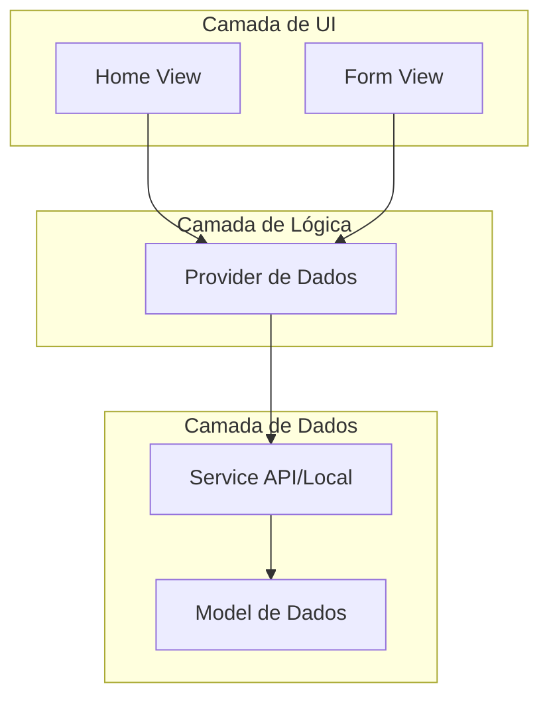

# Aula 16 - Projeto Final Integrador 🎓

!!! success "Objetivo Final"
    Parabéns por chegar até aqui! Agora é hora de unir todo o conhecimento em um único projeto profissional completo.

---

## 1. O Desafio Final 🏆

Você deverá desenvolver um aplicativo multiplataforma (Mobile, Web e Desktop) que resolva um problema real. 

### Sugestões de Temas
1.  **Lista de Tarefas (ToDo)**: Com persistência local e categorias.
2.  **Controle Financeiro Simples**: Cadastro de gastos e receitas com gráficos.
3.  **Agenda de Contatos**: Com integração de foto e busca.

---

## 2. Requisitos Obrigatórios ✅

Para que o projeto seja considerado completo, ele deve conter:

*   **Arquitetura**: Separação em camadas (Models, Services, Providers).
*   **UI/UX**: Layout responsivo (funciona bem em telas grandes e pequenas).
*   **Navegação**: Pelo menos duas telas.
*   **Dados**: Consumo de uma API externa OU persistência local (SQLite/SharedPrefs).
*   **Formulários**: Cadastro de dados com validação.

---

## 3. Estrutura do Projeto (Mermaid) 📊

---

## 4. Preparando para Apresentação 🚀

Um bom desenvolvedor também sabe apresentar seu trabalho.

1.  **Faça o Build**: Gere o APK, a versão Web e o executável Desktop.
2.  **Repositório**: Suba o código para o GitHub com um `README.md` bem escrito.
3.  **Vídeo/GIF**: Grave o funcionamento do app em diferentes telas.

---

## 5. Próximos Passos na Carreira 🚀

O aprendizado não para aqui. Explore:
*   Gerenciamento de estado avançado (Bloc, Riverpod).
*   Testes Unitários e de Integração avançados.
*   Integração com Firebase (Auth, Firestore, Cloud Functions).

---

!!! tip "Certificação"
    Conclua o projeto, publique no seu portfólio e compartilhe sua conquista!

---

**Fim da Jornada!** Boas codificações! 📱💻🚀
