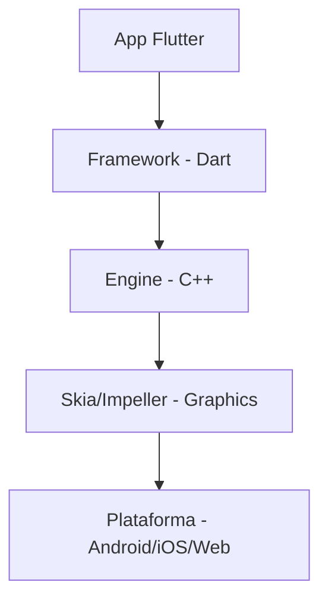

# Aula 01 - Introdução ao Desenvolvimento Multiplataforma 🌍
## Um Código, Todas as Telas

---

## Agenda de Hoje 📅

1. O que é Multiplataforma? <!-- .element: class="fragment" -->
2. Nativo vs Híbrido vs Flutter <!-- .element: class="fragment" -->
3. Por que Flutter? <!-- .element: class="fragment" -->
4. Ecossistema e Renderização <!-- .element: class="fragment" -->
5. Ferramentas Necesárias <!-- .element: class="fragment" -->
6. Primeiro Projeto <!-- .element: class="fragment" -->

---

## 1. O Desafio Mobile 📱

- Antes: Equipes separadas para Android (Java) e iOS (Swift). <!-- .element: class="fragment" -->
- Problema: Custo dobrado e manutenção difícil. <!-- .element: class="fragment" -->
- Solução: Frameworks Multiplataforma. <!-- .element: class="fragment" -->

---

## 2. Abordagem Nativa 🍎🤖

- Performance máxima. <!-- .element: class="fragment" -->
- Acesso total ao hardware. <!-- .element: class="fragment" -->
- Duas bases de código. <!-- .element: class="fragment" -->

---

## 3. Abordagem Híbrida (WebView) 🌐

- HTML/CSS/JS dentro de um navegador. <!-- .element: class="fragment" -->
- Lento e com visual "não-nativo". <!-- .element: class="fragment" -->
- Ex: PhoneGap, Cordova. <!-- .element: class="fragment" -->

---

## 4. O Diferencial do Flutter 🦄

- Desenha cada pixel na tela (Canvas). <!-- .element: class="fragment" -->
- Não usa WebView nem OEM Widgets nativos. <!-- .element: class="fragment" -->
- Alta performance (60/120 fps). <!-- .element: class="fragment" -->

---

## 5. Estrutura de Renderização 📊



---

## 6. Por que Dart? 🎯

- Compilação AOT (Ahead-of-Time). <!-- .element: class="fragment" -->
- Ciclo de desenvolvimento rápido (JIT). <!-- .element: class="fragment" -->
- Otimizada para interfaces de usuário. <!-- .element: class="fragment" -->

---

## 7. Hot Reload: Magia Pura ⚡

- Mudanças instantâneas no código. <!-- .element: class="fragment" -->
- Mantém o estado do app. <!-- .element: class="fragment" -->
- Produtividade multiplicada por 10. <!-- .element: class="fragment" -->

---

## 8. Cinto de Utilidades 🛠️

- Flutter SDK <!-- .element: class="fragment" -->
- Android Studio / VS Code <!-- .element: class="fragment" -->
- Emuladores ou Celular Real <!-- .element: class="fragment" -->

---

## 9. Flutter Doctor 🩺

- "O médico do seu ambiente". <!-- .element: class="fragment" -->
- Mostra o que falta instalar. <!-- .element: class="fragment" -->
- Garante que tudo está pronto para rodar. <!-- .element: class="fragment" -->

---

## 10. Criando seu Primeiro App 🚀

```termynal
$ flutter create meu_app
$ cd meu_app
$ flutter run
```

---

## 11. Onde as Mágicas Acontecem? 📂

- Pasta `lib/`: Seu código mora aqui. <!-- .element: class="fragment" -->
- Arquivo `main.dart`: O coração do app. <!-- .element: class="fragment" -->

---

## 12. Plataformas Suportadas 🍏🤖🖥️🌐

- Android & iOS (Mobile) <!-- .element: class="fragment" -->
- Web (HTML/Wasm) <!-- .element: class="fragment" -->
- Windows, macOS, Linux (Desktop) <!-- .element: class="fragment" -->

---

## 13. Flutter no Mercado 💼

- Usado por: Google, Alibaba, BMW, Nubank. <!-- .element: class="fragment" -->
- Comunidade gigante e crescente. <!-- .element: class="fragment" -->

---

## Resumo da Aula ✅

- Flutter = Alta Performance + Um Código. <!-- .element: class="fragment" -->
- Dart = Linguagem produtiva. <!-- .element: class="fragment" -->
- Hot Reload = Super poder. <!-- .element: class="fragment" -->

---

## Próxima Aula: Linguagem Dart 🎯

- Variáveis, Funções e Lógica. <!-- .element: class="fragment" -->
- Preparando para o código real. <!-- .element: class="fragment" -->

---

## Dúvidas? 🤔

> "Escreva uma vez, execute em qualquer lugar."
