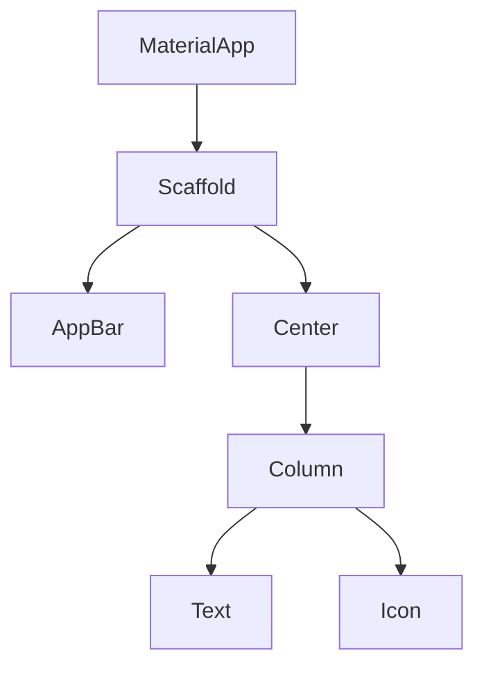

# Aula 04 - Widgets: A Base de Tudo 🧱
## Pensando em Widgets

---

## Agenda de Hoje 📅

1. O Conceito de Widget { .fragment }
2. Stateless vs Stateful { .fragment }
3. O Ciclo de Vida { .fragment }
4. A Árvore de Widgets { .fragment }
5. Hot Reload na Prática { .fragment }

---

## 1. O que é um Widget? 🤔

- "Tudo no Flutter é um Widget". { .fragment }
- Elementos visuais (botões). { .fragment }
- Atributos estruturais (alinhamento). { .fragment }
- Estilos (cores, temas). { .fragment }

---

## 2. Abordagem Declarativa 🗣️

- "Como a UI deve parecer para este estado?" { .fragment }
- Diferente do imperativo (como mudar a UI manualmente). { .fragment }

---

## 3. StatelessWidget ⚪

- Imutável. { .fragment }
- Perfeito para interfaces estáticas. { .fragment }
- Ex: Uma logo, um ícone, um texto fixo. { .fragment }

---

## 4. StatefulWidget 🔴

- Pode mudar de aparência. { .fragment }
- Possui um objeto `State`. { .fragment }
- Ex: Contador, campo de texto, checkbox. { .fragment }

---

## 5. O Método build() 🏗️

- Onde você descreve a hierarquia de widgets. { .fragment }
- Chamado sempre que o widget precisa ser redesenhado. { .fragment }

---

## 6. setState(): O Gatilho 🔫

- Avisa o Flutter: "Os dados mudaram!". { .fragment }
- Agenda um novo `build()`. { .fragment }

---

## 7. A Árvore de Widgets (Widget Tree) 🌳

---

## 8. Composição sobre Herança 🧩

- Juntamos widgets pequenos para formar widgets maiores. { .fragment }
- Evitamos heranças complexas. { .fragment }

---

## 9. Propriedades (Construtores) 📦

- Passamos dados para os widgets via parâmetros. { .fragment }
- `Text("Olá", style: TextStyle(fontSize: 20))` { .fragment }

---

## 10. O Ciclo de Vida do Stateful ⏳

- `initState()`: Inicialização. { .fragment }
- `build()`: Construção visual. { .fragment }
- `dispose()`: Limpeza. { .fragment }

---

## 11. Const Widgets 💎

- Desempenho! Widgets constantes não precisam ser reconstruídos. { .fragment }
- Use `const` sempre que possível. { .fragment }

---

## 12. Hot Reload: Vendo a Mágica ⚡

- Altere o texto do seu widget. { .fragment }
- Aperte `Ctrl+S` (ou `r` no terminal). { .fragment }
- Veja a mudança instantânea sem perder onde você estava. { .fragment }

---

## Resumo da Aula ✅

- Widgets são peças de Lego. { .fragment }
- Stateless = Estático. { .fragment }
- Stateful = Dinâmico. { .fragment }

---

## Próxima Aula: Layouts e Organização 🎨

- Column e Row. { .fragment }
- Alinhando tudo como um Pro. { .fragment }

---

## Dúvidas? 🤔

> "No Flutter, a perfeição da interface vem da composição de pequenos widgets perfeitos."
