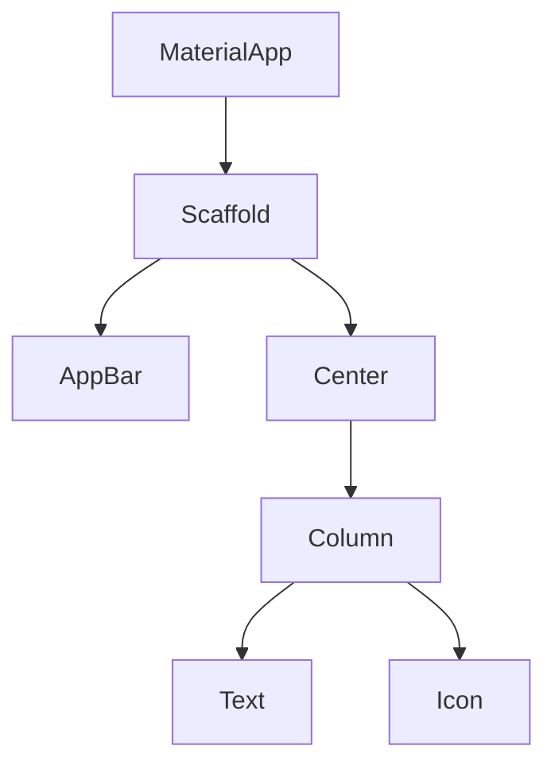

# Aula 04 - Widgets: A Base de Tudo 🧱
## Pensando em Widgets

---

## Agenda de Hoje 📅

1. O Conceito de Widget <!-- .element: class="fragment" -->
2. Stateless vs Stateful <!-- .element: class="fragment" -->
3. O Ciclo de Vida <!-- .element: class="fragment" -->
4. A Árvore de Widgets <!-- .element: class="fragment" -->
5. Hot Reload na Prática <!-- .element: class="fragment" -->

---

## 1. O que é um Widget? 🤔

- "Tudo no Flutter é um Widget". <!-- .element: class="fragment" -->
- Elementos visuais (botões). <!-- .element: class="fragment" -->
- Atributos estruturais (alinhamento). <!-- .element: class="fragment" -->
- Estilos (cores, temas). <!-- .element: class="fragment" -->

---

## 2. Abordagem Declarativa 🗣️

- "Como a UI deve parecer para este estado?" <!-- .element: class="fragment" -->
- Diferente do imperativo (como mudar a UI manualmente). <!-- .element: class="fragment" -->

---

## 3. StatelessWidget ⚪

- Imutável. <!-- .element: class="fragment" -->
- Perfeito para interfaces estáticas. <!-- .element: class="fragment" -->
- Ex: Uma logo, um ícone, um texto fixo. <!-- .element: class="fragment" -->

---

## 4. StatefulWidget 🔴

- Pode mudar de aparência. <!-- .element: class="fragment" -->
- Possui um objeto `State`. <!-- .element: class="fragment" -->
- Ex: Contador, campo de texto, checkbox. <!-- .element: class="fragment" -->

---

## 5. O Método build() 🏗️

- Onde você descreve a hierarquia de widgets. <!-- .element: class="fragment" -->
- Chamado sempre que o widget precisa ser redesenhado. <!-- .element: class="fragment" -->

---

## 6. setState(): O Gatilho 🔫

- Avisa o Flutter: "Os dados mudaram!". <!-- .element: class="fragment" -->
- Agenda um novo `build()`. <!-- .element: class="fragment" -->

---

## 7. A Árvore de Widgets (Widget Tree) 🌳

---

## 8. Composição sobre Herança 🧩

- Juntamos widgets pequenos para formar widgets maiores. <!-- .element: class="fragment" -->
- Evitamos heranças complexas. <!-- .element: class="fragment" -->

---

## 9. Propriedades (Construtores) 📦

- Passamos dados para os widgets via parâmetros. <!-- .element: class="fragment" -->
- `Text("Olá", style: TextStyle(fontSize: 20))` <!-- .element: class="fragment" -->

---

## 10. O Ciclo de Vida do Stateful ⏳

- `initState()`: Inicialização. <!-- .element: class="fragment" -->
- `build()`: Construção visual. <!-- .element: class="fragment" -->
- `dispose()`: Limpeza. <!-- .element: class="fragment" -->

---

## 11. Const Widgets 💎

- Desempenho! Widgets constantes não precisam ser reconstruídos. <!-- .element: class="fragment" -->
- Use `const` sempre que possível. <!-- .element: class="fragment" -->

---

## 12. Hot Reload: Vendo a Mágica ⚡

- Altere o texto do seu widget. <!-- .element: class="fragment" -->
- Aperte `Ctrl+S` (ou `r` no terminal). <!-- .element: class="fragment" -->
- Veja a mudança instantânea sem perder onde você estava. <!-- .element: class="fragment" -->

---

## Resumo da Aula ✅

- Widgets são peças de Lego. <!-- .element: class="fragment" -->
- Stateless = Estático. <!-- .element: class="fragment" -->
- Stateful = Dinâmico. <!-- .element: class="fragment" -->

---

## Próxima Aula: Layouts e Organização 🎨

- Column e Row. <!-- .element: class="fragment" -->
- Alinhando tudo como um Pro. <!-- .element: class="fragment" -->

---

## Dúvidas? 🤔

> "No Flutter, a perfeição da interface vem da composição de pequenos widgets perfeitos."
